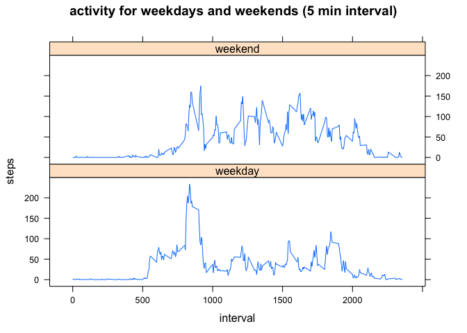

# Reproducible Research: Peer Assessment 1
This report makes use of data from a personal activity monitoring device. This device collects data at 5 minute intervals through out the day. The data consists of two months of data from an anonymous individual collected during the months of October and November, 2012 and include the number of steps taken in 5 minute intervals each day.

The report will analyze the data and show relative conclusions

## Loading and preprocessing the data
Loading and data https://d396qusza40orc.cloudfront.net/repdata%2Fdata%2Factivity.zip

```r
## Read activity monitor data
act.mon.dat <- read.csv("activity.csv", na.strings = "Not Available")
##set the steps from char to integer
act.mon.dat$steps <- as.numeric(levels(act.mon.dat$steps))[act.mon.dat$steps]
##set the date from factor to date
act.mon.dat$date <- as.Date(act.mon.dat$date, format = "%Y-%m-%d")
##str(act.mon.dat)
```

## What is mean total number of steps taken per day?
This will give an idea of how many steps were taken per day over the study period 

```r
set.seed(5689)
## Create a Histogram for mean steps by day
## Required Libraries
library("ggplot2")

##Summarize steps by day
act.mon.sum <- aggregate(steps ~ date, act.mon.dat, sum, na.action=na.pass, na.rm=TRUE)

ggplot(data=act.mon.sum, aes(x=act.mon.sum$date, y=act.mon.sum$steps)) + 
  geom_histogram(stat="identity", position="dodge") +
  xlab("Date of Monitor reading") + 
  ylab("Steps Taken") +
  ggtitle("Average steps taken by day") 
```

 

Display the mean and median steps per day for the time period day

```r
library("xtable")
##Summarize mean and median steps per day for the full 2 month period
df <- data.frame(mean = mean(act.mon.sum$steps), median = median(act.mon.sum$steps))
xt <- xtable(df)
print(xt, type="html")
```

<!-- html table generated in R 3.1.1 by xtable 1.7-4 package -->
<!-- Sat Feb 14 14:38:34 2015 -->
<table border=1>
<tr> <th>  </th> <th> mean </th> <th> median </th>  </tr>
  <tr> <td align="right"> 1 </td> <td align="right"> 9354.23 </td> <td align="right"> 10395.00 </td> </tr>
   </table>

## What is the average daily activity pattern?
This section will give an idea of the activity level of the person during
a given day broken up into 5 minute intervals

```r
## Create a Time Series Plot of 5 minutes intervals averages over period
## Required Libraries
library("ggplot2")

##Summarize steps by interval
##act.mon.int <- aggregate(steps ~ interval, act.mon.dat, sum)
act.mon.int <- aggregate(steps ~ interval, act.mon.dat, mean,
                           na.action=na.pass, na.rm=TRUE)

ggplot(data=act.mon.int, aes(x=act.mon.int$interval, y=act.mon.int$steps)) + 
  geom_line(stat="identity") +
  xlab("5 minute periods starting at 12:00 am") + 
  ylab("Steps Taken") +
  ggtitle("Average steps taken by 5 minute period") 
```

 

```r
##display the max number of steps five minute interval
intmax <- act.mon.int[which(act.mon.int$steps == max(act.mon.int$steps)), ]
df <- data.frame(intervalMax = intmax$interval, steps = intmax$steps)
xt <- xtable(df)
print(xt, type="html")
```

<!-- html table generated in R 3.1.1 by xtable 1.7-4 package -->
<!-- Sat Feb 14 14:38:34 2015 -->
<table border=1>
<tr> <th>  </th> <th> intervalMax </th> <th> steps </th>  </tr>
  <tr> <td align="right"> 1 </td> <td align="right"> 835 </td> <td align="right"> 206.17 </td> </tr>
   </table>

## Imputing missing values
The analysis below will show the total number of missing step values (not recorded)
for five minute interval versus and the total number of rows (5 minute intervals).

We will replace the the missing rows with the mean for the 5 minute
Period over the full numnber of days.

```r
## Create a Time Series Plot of 5 minutes intervals averages over period
## Required Libraries
library("ggplot2")

##Calculate and report the total number of missing values in the dataset
##(i.e. the total number of rows with NAs)
##calculate sum of all columns with missing values, 1st col is steps
mv <- colSums(is.na(act.mon.dat))
##display in table to be a little cleaner looking in report
df <- data.frame(MissingValues = mv[1], TotalValues = nrow(act.mon.dat))
xt <- xtable(df)
print(xt, type="html")
```

<!-- html table generated in R 3.1.1 by xtable 1.7-4 package -->
<!-- Sat Feb 14 14:38:34 2015 -->
<table border=1>
<tr> <th>  </th> <th> MissingValues </th> <th> TotalValues </th>  </tr>
  <tr> <td align="right"> steps </td> <td align="right"> 2304.00 </td> <td align="right"> 17568 </td> </tr>
   </table>

```r
##Replace missing 5 minute intervals with mean for that 
##interval accross sample - this code gives warning, worked fine for while
##strange, could have done it in loop, but works ok I guess
act.mon.dat[is.na(act.mon.dat$steps), "steps"] <- subset(act.mon.int, act.mon.dat$interval %in% act.mon.int$interval, select=steps)

##Summarize steps by day with missing values replaced
act.mon.sum <- aggregate(steps ~ date, act.mon.dat, sum, 
                         na.action=na.pass, na.rm=TRUE)

ggplot(data=act.mon.sum, aes(x=act.mon.sum$date, y=act.mon.sum$steps)) + 
  geom_histogram(stat="identity", position="dodge") +
  xlab("Date of Monitor reading") + 
  ylab("Steps Taken") +
  ggtitle("Average steps taken by day (means for missing values)") 
```

 
Display the mean and median steps per day for the time period day
with missing values replaced with the associated 5 minute interval means?

```r
library("xtable")
##Summarize mean and median steps per day for the full 2 month period
df <- data.frame(mean = mean(act.mon.sum$steps), median = median(act.mon.sum$steps))
xt <- xtable(df)
print(xt, type="html")
```

<!-- html table generated in R 3.1.1 by xtable 1.7-4 package -->
<!-- Sat Feb 14 14:38:34 2015 -->
<table border=1>
<tr> <th>  </th> <th> mean </th> <th> median </th>  </tr>
  <tr> <td align="right"> 1 </td> <td align="right"> 9530.72 </td> <td align="right"> 10439.00 </td> </tr>
   </table>

## Are there differences in activity patterns between weekdays and weekends?
The results below will give an idea of the different levels of activity
between weekends and weekdays.  You can see weekend are more active as they 
should be.

```r
## Create a Time Series Plot of 5 minutes intervals averages over period
## Required Libraries
##library("ggplot2")
library("lattice") 

##Add a WeekDay and WeekEnd col to data frame
## Add day names first
act.mon.dat$week <- weekdays(act.mon.dat$date)
## make weekdays and weekends and convert to factor
act.mon.dat$week[act.mon.dat$week %in% c("Monday", "Tuesday",
                 "Wednesday", "Thursday", "Friday")] <- "weekday"
act.mon.dat$week[act.mon.dat$week %in% c("Saturday", "Sunday")] <- "weekend"
act.mon.dat$week <- as.factor(act.mon.dat$week)

##Summarize steps by interval
act.mon.int <- aggregate(steps ~ interval + week, act.mon.dat, mean,
                           na.action=na.pass, na.rm=TRUE)

xyplot(steps ~ interval | week,
      data = act.mon.int, 
      type = "l", layout=(c(1,2)),
      main = "activity for weekdays and weekends (5 min interval)")
```

 
